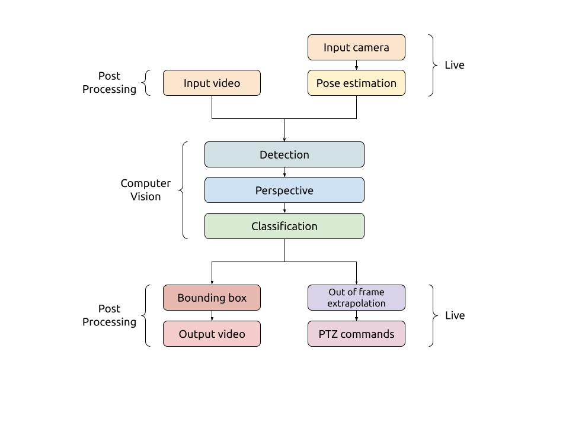

Code details
============

Structure
---------

Design
------

Every component of Discam is designed to be *streamable*, or able to process frames on
the fly and return results at every iteration.
Deploying as an automatic PTZ camera requires such ability.

Therefore, most components in the pipeline are implemented as a ``class``, with an ``update``
method to process a single frame.

When running Discam in Post Processing, the pipeline is run sequentially through the video.

Pipeline
--------

This image shows a schematic of the modules that make up the overall pipeline.

The different modes (Post Processing and Live) have different inputs and outputs.
A shared set of computer vision modules is used to determine the outputs.
