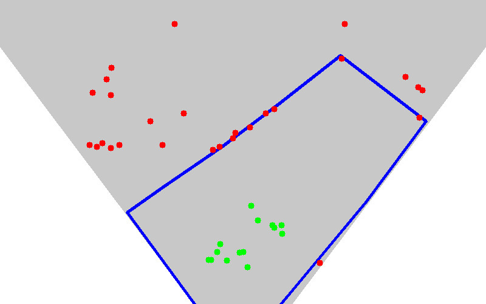

Perspective
===========

The perspective module estimates 3D camera location and perspective with respect
to the ground plane.

This is to determine the physical location of each person, which increases
active player classification accuracy.

This image shows the predicted player locations, the manually drawn field mask,
and the camera FOV.
