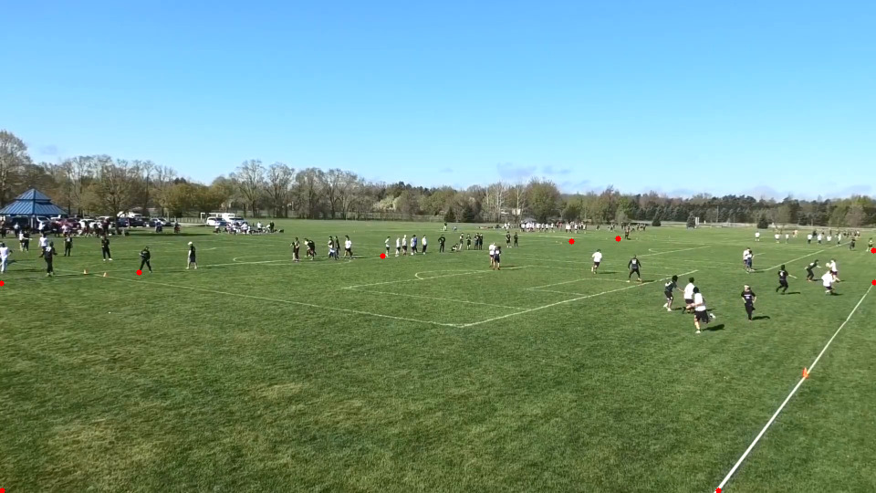

Post Processing
===============

"Post Processing" refers to automated editing of a film video file, after it is recorded.

Discam takes in a video file (and other required data), and produces the output processed video.
Processing consists of:

* Crop the video to follow the active players.
* Detect and trim idle film sections in between points.
* Output video compression with ffmpeg.

Field mask
----------

The program requires a manually drawn mask of the Frisbee field of interest.
It should be reasonably accurate.
The mask should err on being *larger* (rather than smaller) than the field.

Use the ``discmask`` utility to interactively draw a polygon mask.
The tool will generate a ``.npy`` file.
It *must* be named the same as the video, with the ``.npy`` extension.

.. code-block:: bash

   # Usage: discmask <input> <output>
   discmask film.mp4 film.npy

Click on points to trace the contour of the field in a consistent direction.

When finished, press ``q``.

The image above shows an example of using ``discmask`` (note the red points).

Running post processing
-----------------------

Use the ``discpost`` utility to generate the output video.

.. code-block:: bash

   discpost film.mp4

The file structure is:

.. code-block:: bash

   dir/
     film.mp4   # Input film.
     film.npy   # Field mask (see above).
     film.discout.mp4   # Output film.
     film.discache/     # Discam cache files.
       ...

Keep in mind that Post Processing may take a while to run.

Options
-------

``--no_cache``
^^^^^^^^^^^^^^

Don't load CV pipeline results from cache.
I.e. always run the CV pipeline through the entire video.

Will write results to cache regardless of whether this option is set.

.. code-block:: bash

   discpost film.mp4 --no_cache

``--fps_scale``
^^^^^^^^^^^^^^^

Output video FPS downscaling.
E.g. if input FPS is ``60`` and ``--fps_scale=2``, then output FPS is ``30``.

Must be an integer.

Decreasing FPS makes output video writing significantly faster (linear speed boost).
File size is also reduced, but less drastically.

.. code-block:: bash

   discpost film.mp4 --fps_scale 2
